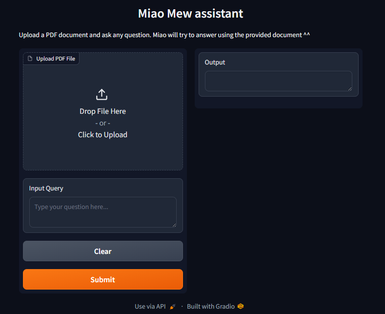
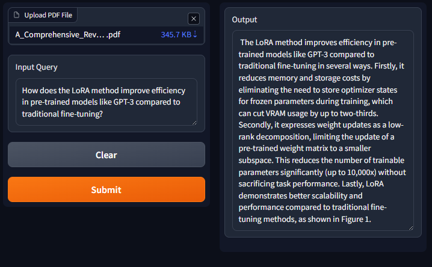
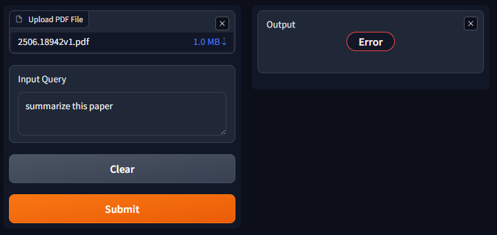

# Miao :cat: your assistant 🧠

Miao Assistant is an implementation of a Retrieval-Augmented Generation (RAG) system with LangChain that can read, understand, and summarize vast amounts of data in real time. It is currently being developed to function as a local assistant on a personal machine.

## 🚀 Technologies: 
Python · LangChain · watsonx.ai (Mistral 8x7B) · Chroma DB · Gradio

## 🧩 How it work:

Load your document and ask any question as you want :), see:

At the moment, for small-size files, it works well 💯 as the following:

But not yet perfect for the bigger ones, for example:

## What it has done so far:
Designed and implemented an intelligent assistant capable of reading, understanding, and summarizing complex documents in real time using a Retrieval-Augmented Generation (RAG) architecture.

Built an end-to-end RAG pipeline: document loading, text chunking, embedding generation, and vector storage with Chroma for semantic search.

Developed a retriever–LLM QA bot with a Gradio interface, integrating watsonx.ai API (Mistral 8x7B) for contextual question answering and summarization.

Achieved high factual reliability, Grounded Answer Rate = 87.1 %, and Hallucination < 4 % on the test dataset.

## 💡 Future improvement:
Currently optimizing for local deployment and large-file processing, after identifying performance bottlenecks on multi-MB PDF inputs
and of course expect to be the best local assistant on a personal machine ;) 
